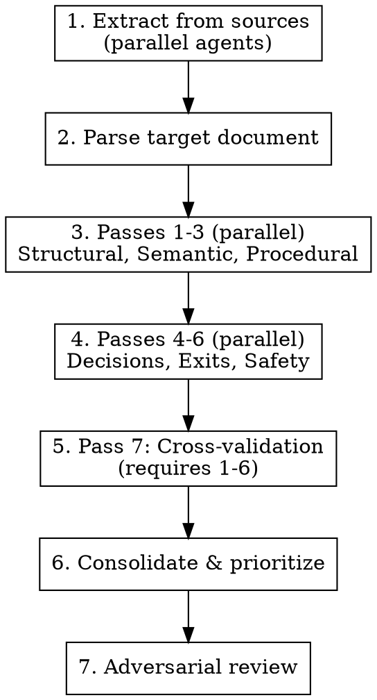

# Gap Analysis

## Overview

Gap analysis finds what's missing, incomplete, or inaccurate when comparing a target document against source materials. A single pass checking "is X mentioned?" misses decision rules, exit criteria, and safety defaults — single sentences with outsized impact.

**Core insight:** The items most often missed are single sentences that define behavior at decision points.

## When to Use

- After creating a design document from multiple sources
- When verifying a specification captures all requirements
- Before implementing from a design (verify completeness)
- When merging methodologies from different sources

## When NOT to Use

- Simple document reviews (use standard review)
- Single-source summaries (no gap to analyze)
- Code reviews (use code-review skills)

## The 7-Pass Architecture

One comprehensive pass misses entire categories. Use multiple passes with different lenses.

```
Pass 1: STRUCTURAL        "What sections exist?"
Pass 2: SEMANTIC          "Does meaning match?"
Pass 3: PROCEDURAL        "Are steps complete?"
Pass 4: DECISION RULES    "What happens when uncertain?"
Pass 5: EXIT CRITERIA     "When is each phase done?"
Pass 6: SAFETY DEFAULTS   "What are the fail-safes?"
Pass 7: CROSS-VALIDATION  "Do parts agree with each other?"
```

### Execution Sequence



## Pass Details

### Pass 1: Structural Coverage

**Question:** What sections exist in source vs. target?

**Method:**
1. Extract all H2/H3 headings from each source
2. Extract all H2/H3 headings from target
3. Diff the lists

**Flag:** Missing, added, renamed, merged

### Pass 2: Semantic Fidelity

**Question:** Does the target preserve source meaning?

**Method:**
1. For each key concept in source, find corresponding concept in target
2. Compare definitions
3. Rate: preserved, paraphrased (ok), distorted (problem), omitted (gap)

**Flag:** Distortions, oversimplifications, lost nuance

### Pass 3: Procedural Completeness

**Question:** Are steps fully specified?

**For each step, verify:**
- [ ] Precondition stated?
- [ ] Action is executable (not vague)?
- [ ] Postcondition/output defined?
- [ ] Error handling specified?

**Flag:** Vague steps, missing error handling, unclear sequencing, numbering gaps

### Pass 4: Decision Rules ⚠️

**Question:** What happens at decision points when uncertain?

**This pass catches the most critical gaps.** Decision rules are often single sentences with outsized behavioral impact.

**For each decision point:**
- [ ] All branches specified?
- [ ] Default case defined?
- [ ] Ambiguous case handled?
- [ ] Escalation path when stuck?

**Look for:** if/then without else, conditionals without defaults, branches without coverage

### Pass 5: Exit Criteria ⚠️

**Question:** When is each phase considered "done"?

**For each phase/loop:**
- [ ] Explicit completion criteria?
- [ ] Termination condition for loops?
- [ ] Quality bar defined (not just "finished")?
- [ ] What prevents premature exit?

**Look for:** Phases without "done when", loops without termination, vague completion

### Pass 6: Safety Defaults ⚠️

**Question:** What happens when things go wrong or are uncertain?

**For each risk point:**
- [ ] Default behavior when uncertain?
- [ ] Escalation when risk detected?
- [ ] Rollback/recovery path?
- [ ] Guard against common failures?

**Look for:** Risk operations without guards, missing escalation rules, no rollback

### Pass 7: Cross-Validation

**Question:** Do all parts agree internally?

**Check:**
- Inputs in procedure ⊆ Inputs section?
- Outputs in procedure ⊆ Outputs section?
- Terminology consistent throughout?
- Counts match (e.g., "7 categories" → actually 7)?

## Consolidated Checklist

Use this checklist for each source document reviewed:

```markdown
## Gap Analysis: [Source] → [Target]

### Structural (Pass 1)
- [ ] All sections accounted for (present, intentionally omitted, or merged)

### Semantic (Pass 2)
- [ ] Key definitions match source
- [ ] No oversimplifications that lose meaning

### Procedural (Pass 3)
- [ ] Every step has: trigger, action, result
- [ ] Step numbering sequential (no gaps, no duplicates)

### Decision Rules (Pass 4) ⚠️
- [ ] Every if/then has all branches defined
- [ ] Default behavior stated for ambiguous cases
- [ ] Escalation path when stuck

### Exit Criteria (Pass 5) ⚠️
- [ ] Every phase has explicit "done when" criteria
- [ ] Every loop has termination condition
- [ ] Quality bar defined (not just completion)

### Safety (Pass 6) ⚠️
- [ ] Risk escalation rules present
- [ ] Fail-safe defaults for uncertain situations
- [ ] Rollback/recovery paths for reversible operations

### Cross-Validation (Pass 7)
- [ ] Inputs in procedure ⊆ Inputs section
- [ ] Outputs in procedure ⊆ Outputs section
- [ ] Terminology consistent
- [ ] Counts/numbers verified
```

## Priority Classification

| Priority | Criteria | Example |
|----------|----------|---------|
| **Critical** | Breaks execution or correctness | Duplicate steps, missing required section |
| **High** | Changes behavior significantly | Missing decision default, no exit criteria |
| **Medium** | Affects quality or completeness | Missing reference, incomplete coverage |
| **Low** | Polish or optimization | Description wording, example quality |

**Key insight:** Small items (single sentences) can be Critical if they define behavior at decision points.

## Anti-Patterns

| Anti-Pattern | Problem | Fix |
|--------------|---------|-----|
| Single-pass analysis | Misses entire categories | Use 7-pass architecture |
| "Is X mentioned?" only | Doesn't check completeness | Add "Is X complete?" |
| Section-level granularity | Misses sentence-level rules | Check decision points individually |
| No adversarial pass | Confirmation bias | Challenge findings before finalizing |
| Prioritize by size | Small items can be critical | Prioritize by impact, not length |
| Parallel without synthesis | Duplicates and contradictions | Consolidation pass required |

## Common Mistakes

### Checking presence, not completeness

❌ "The design mentions risk tiers" → ✅ "The design has tier criteria but missing per-tier minimums"

### Missing single-sentence rules

These are often the most impactful gaps:
- Auto-escalation rules
- Default behaviors
- Termination conditions
- Safety guards

### Skipping passes 4-6

Passes 1-3 feel complete but miss decision rules, exit criteria, and safety defaults. These three passes catch the gaps that cause execution failures.

### No cross-validation

Internal contradictions escape detection without Pass 7. "7 categories" in one place, 6 listed in another.

## Verification

After completing analysis, verify:

1. **Coverage:** Did each pass produce findings (even "no gaps")?
2. **Prioritization:** Are Critical items actually execution-breaking?
3. **Actionability:** Does each gap have a clear resolution?
4. **Adversarial check:** What gaps might this analysis have missed?

## Quick Reference

| Pass | Question | Catches |
|------|----------|---------|
| 1. Structural | What sections? | Missing sections |
| 2. Semantic | Meaning match? | Distortions |
| 3. Procedural | Steps complete? | Vague steps |
| 4. Decisions | When uncertain? | Missing defaults |
| 5. Exits | When done? | No termination |
| 6. Safety | What if wrong? | No guards |
| 7. Cross-val | Parts agree? | Contradictions |
