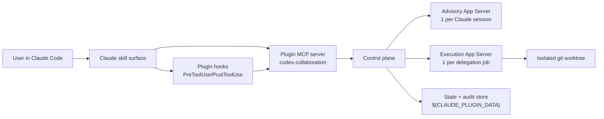

# Codex Collaboration Plugin Design

Greenfield replacement architecture for a Claude Code plugin that lets Claude consult, dialogue with, and delegate to OpenAI Codex while keeping Claude as the primary agent.

## Summary

The recommended design is a **split-runtime Claude plugin**:

- one **advisory Codex App Server runtime** per Claude session for consultation and multi-turn dialogue
- one **ephemeral execution Codex App Server runtime** per delegation job, always isolated in its own git worktree
- one **Claude-side control plane** inside the plugin that exposes a small MCP surface to Claude and never exposes raw Codex App Server RPCs directly
- one **outer hook guard** in Claude Code that remains the strongest fail-closed trust boundary before any Codex request is dispatched

This design uses Codex App Server because it is the correct OpenAI surface for rich interactive clients with threads, streamed items, auth, approvals, and server-initiated requests. It explicitly avoids a single shared Codex runtime for both advisory and autonomous execution because App Server supports session-scoped approvals, and that makes runtime boundaries part of the security model rather than a mere implementation detail.

## Greenfield Rules

This design does **not** preserve the current cross-model plugin's:

- slash-command names
- event schemas
- consultation contracts
- `conversation_id == threadId` assumptions
- delegation pipeline stages
- analytics payloads

The existing package is only useful as a list of failure modes to avoid. The new system defines its own logical contracts and storage model.

## Source-Grounded Constraints

The design below is shaped by the following documented facts:

| Source | Fact | Design implication |
| --- | --- | --- |
| Claude Code plugin docs | Plugins can bundle hooks, skills, agents, and MCP servers. Plugin files are copied into a cache on install. `${CLAUDE_PLUGIN_ROOT}` is versioned and `${CLAUDE_PLUGIN_DATA}` is the persistent state location. | The plugin must keep all durable state and generated artifacts in `${CLAUDE_PLUGIN_DATA}`, not in the plugin root. |
| Claude Code hooks docs | `PreToolUse` hooks can `allow`, `deny`, or `ask` before a tool call runs. | Keep a Claude-side PreToolUse guard as the authoritative outer enforcement point. |
| Claude Code sub-agent docs | Plugin-provided subagents do not support `hooks`, `mcpServers`, or `permissionMode` frontmatter. | Do not put trust-boundary logic into plugin agents. Put it in hooks and the plugin MCP server. |
| OpenAI Codex docs | App Server is the rich-client protocol for auth, history, approvals, and streamed agent events. The SDK is for CI and automation. | Use App Server as the primary Codex transport for this plugin. |
| OpenAI Codex docs | App Server is bidirectional JSON-RPC and can issue server-initiated approval and user-input requests. | The plugin needs a real request router, not a fire-and-forget subprocess wrapper. |
| OpenAI Codex docs | `thread/start`, `thread/resume`, `thread/fork`, `thread/read`, `turn/start`, `turn/steer`, and `turn/interrupt` are first-class. | Use thread-native dialogue instead of emulating conversation state above `codex exec`. |
| OpenAI Codex docs | App Server approvals support `acceptForSession`. | Never share one Codex runtime across advisory and execution capability classes. |
| OpenAI Codex docs | WebSocket transport is experimental; stdio is the default transport. | Use stdio only in v1. |
| Upstream `codex-rs` code | The app-server runtime already contains plugin listing, app listing, auth flows, command exec, filesystem APIs, and thread lifecycle management. | Treat App Server as a substantial stateful runtime. Do not casually embed all use cases into one process. |
| Upstream `codex-rs` code | Core `fork_thread` snapshots a mid-turn source as interrupted rather than inheriting an ambiguous partial suffix. | The plugin must maintain explicit fork lineage and recovery semantics rather than assuming history copies are trivial. |

## Goals

- Give Claude a structured second-opinion lane to Codex.
- Support durable, branchable, multi-turn Claude-to-Codex dialogues.
- Support autonomous Codex task execution without weakening Claude's control.
- Preserve strong trust boundaries around secrets, paths, sandboxing, and write surfaces.
- Make crash recovery and lineage explicit.
- Stay on stable App Server APIs where possible.

## Non-Goals

- Preserve compatibility with the current `cross-model` contracts.
- Expose raw App Server methods to Claude.
- Depend on experimental App Server features for core flows when a stable path exists.
- Let Codex write directly into the user's primary working tree during delegation.
- Use Codex-side plugin/app discovery as a core dependency of the collaboration model.

## Architecture Options

### Option A: `codex exec` wrapper, improved

Keep a stateless wrapper around `codex exec`, add better prompt packing, and maybe scrape JSONL more carefully.

Pros:

- smallest implementation
- low operational complexity
- easiest to prototype

Cons:

- still batch-shaped
- weak multi-turn dialogue
- awkward approval handling
- poor crash recovery and thread lineage

Verdict: reject. It does not actually supersede the current transport limitations.

### Option B: one long-lived App Server for everything

Run a single App Server child process behind the plugin and route consult, dialogue, and delegate through it.

Pros:

- simplest App Server integration
- single protocol client
- maximum thread reuse

Cons:

- session-scoped approvals can bleed across capability classes
- delegation-grade write access shares a runtime with advisory threads
- operationally convenient but security-incorrect

Verdict: reject. This is the weak idea.

### Option C: split App Server domains

Run one long-lived advisory runtime for consult and dialogue, and one ephemeral execution runtime per delegation job.

Pros:

- uses App Server where it is strongest
- preserves thread-native consultation and dialogue
- isolates execution permissions and workspaces
- supports explicit lineage and recovery

Cons:

- more moving parts than a single broker
- requires two runtime templates and a registry

Verdict: **recommended**.

### Option D: remote broker service

Move the Codex control plane out of the Claude plugin and into a dedicated local or remote daemon.

Pros:

- strongest long-term separation
- easier multi-client reuse
- better place for heavier observability

Cons:

- much more operational surface
- more packaging, auth, and lifecycle complexity
- overkill for the next replacement

Verdict: not for v1.

## Recommended Design

### High-Level Shape



### Claude Plugin Components

Recommended plugin id: `codex-collaboration`

Recommended structure:

```text
packages/plugins/codex-collaboration/
├── .claude-plugin/
│   └── plugin.json
├── skills/
│   ├── consult-codex/
│   │   └── SKILL.md
│   ├── dialogue-codex/
│   │   └── SKILL.md
│   ├── delegate-codex/
│   │   └── SKILL.md
│   └── codex-status/
│       └── SKILL.md
├── hooks/
│   └── hooks.json
├── .mcp.json
├── scripts/
│   ├── codex_guard.py
│   └── codex_runtime_bootstrap.py
├── server/
│   ├── __init__.py
│   ├── mcp_server.py
│   ├── control_plane.py
│   ├── runtime_supervisor.py
│   ├── jsonrpc_client.py
│   ├── approval_router.py
│   ├── worktree_manager.py
│   ├── lineage_store.py
│   ├── prompt_builder.py
│   └── artifact_store.py
├── references/
│   ├── sources.md
│   └── prompts/
│       ├── consult.md
│       ├── dialogue.md
│       ├── delegation.md
│       └── review.md
└── tests/
```

Implementation language recommendation: **Python** for the Claude-side control plane.

Why:

- it matches the repo's current plugin and test conventions
- the existing hook ecosystem is already Python-heavy
- stdio JSON-RPC, process supervision, and worktree orchestration are straightforward in `asyncio`
- the external Codex runtime remains the supported Rust implementation from the Codex CLI

### Runtime Domains

#### 1. Advisory Domain

Purpose:

- quick second opinions
- durable multi-turn dialogue
- branch and compare discussion threads

Shape:

- exactly one advisory App Server runtime per Claude session and repo root
- long-lived for the session
- persisted under `${CLAUDE_PLUGIN_DATA}/runtimes/advisory/<claude-session-id>/`

Policy defaults:

- stdio transport only
- read-only sandbox
- approvals disabled by default
- app connectors disabled by default
- dynamic tools disabled in v1
- file-change approvals auto-declined
- network approvals auto-declined unless the user explicitly requested web-facing work

Rationale:

- Codex gets true thread lifecycle, `turn/steer`, and `thread/fork`
- consult and dialogue can share history safely because they are the same trust class
- no delegation-grade permissions are present in this runtime

#### 2. Execution Domain

Purpose:

- autonomous task execution
- coding, testing, and change production

Shape:

- one ephemeral App Server runtime per delegation job
- one isolated git worktree per delegation job
- persisted under `${CLAUDE_PLUGIN_DATA}/runtimes/delegation/<job-id>/`

Policy defaults:

- stdio transport only
- workspace-write sandbox inside the isolated worktree only
- network disabled by default
- approvals disabled by default
- any request for additional permissions becomes a paused `needs_escalation` job state
- app connectors disabled by default

Rationale:

- no session-scoped approval or write state can leak between jobs
- Codex never mutates the user's primary working tree directly
- Claude stays primary by reviewing and promoting results after the job ends

## MCP Surface Presented to Claude

Do not expose raw App Server methods. Expose a small domain surface:

| Tool | Purpose |
| --- | --- |
| `codex.consult` | One-shot second opinion using the advisory runtime |
| `codex.dialogue.start` | Create a durable dialogue thread |
| `codex.dialogue.reply` | Continue a dialogue turn |
| `codex.dialogue.fork` | Branch a dialogue thread |
| `codex.dialogue.read` | Read dialogue state, branches, and summaries |
| `codex.delegate.start` | Start an isolated execution job |
| `codex.delegate.poll` | Poll job progress and pending approvals |
| `codex.delegate.decide` | Resolve a pending escalation or approval |
| `codex.delegate.promote` | Apply accepted delegation results back to the primary workspace |
| `codex.status` | Health, auth, version, and runtime diagnostics |

Claude-facing skills wrap these tools but do not define the transport.

## Logical Data Model

The plugin maintains its own logical identifiers instead of exposing raw Codex ids everywhere.

### Collaboration Handle

```text
CollaborationHandle
- collaboration_id
- capability_class: advisory | execution
- runtime_id
- codex_thread_id
- parent_collaboration_id?
- fork_reason?
- claude_session_id
- repo_root
- created_at
- status
```

### Delegation Job

```text
DelegationJob
- job_id
- runtime_id
- collaboration_id
- base_commit
- worktree_path
- promotion_state: pending | promoted | discarded
- status: queued | running | needs_escalation | completed | failed | unknown
- artifact_paths
```

### Pending Server Request

```text
PendingServerRequest
- request_id
- runtime_id
- collaboration_id
- codex_thread_id
- codex_turn_id
- item_id
- kind: command_approval | file_change | request_user_input
- requested_scope
- available_decisions
- status
```

## Prompting Model

The plugin owns Codex-side prompt templates.

Each capability builds a structured packet with:

- objective
- relevant repository context
- user constraints
- safety envelope
- expected output shape
- capability-specific instructions

The plugin should not rely on Codex-side skills, plugin discovery, or App Server collaboration modes for core behavior in v1. Those are useful extensions, but they are either optional or experimental. The stable baseline is: explicit prompt packets plus stable thread/turn APIs.

## Core Flows

### Consultation Flow

1. Claude calls `codex.consult`.
2. The hook guard validates the outgoing payload before the tool runs.
3. The control plane starts or reuses the advisory runtime.
4. The control plane starts a fresh Codex thread or forks an existing one if the user is branching from an earlier consult.
5. The control plane sends `turn/start` and projects streamed items into a structured result:
   - Codex position
   - evidence and citations
   - uncertainties
   - suggested follow-up branches
6. Claude synthesizes the final answer.

### Dialogue Flow

1. Claude calls `codex.dialogue.start`.
2. The plugin creates a root advisory thread and returns a `collaboration_id`.
3. Follow-up turns call `codex.dialogue.reply`.
4. Branches call `codex.dialogue.fork`, which maps to App Server `thread/fork`.
5. The plugin records parent-child lineage independently of raw `threadId`.
6. `codex.dialogue.read` reconstructs the logical dialogue tree from plugin lineage plus Codex thread history.

### Delegation Flow

1. Claude calls `codex.delegate.start`.
2. The plugin creates an isolated worktree from the current branch tip.
3. The plugin starts a fresh execution runtime bound to that worktree.
4. Codex executes autonomously inside that worktree.
5. If App Server raises a server request:
   - safe advisory-style auto-approvals are not used here
   - unsupported escalations become `needs_escalation`
   - Claude resolves them with `codex.delegate.decide`
6. When the job completes, the plugin computes:
   - diff summary
   - changed files
   - test results
   - unresolved risks
7. Claude reviews the result.
8. If accepted, `codex.delegate.promote` applies the diff into the main workspace.

## Trust Boundaries

### 1. Outer Boundary: Claude Hook Guard

The Claude-side `PreToolUse` hook remains authoritative.

Responsibilities:

- secret scanning on outgoing payloads
- forbidden path detection
- oversized or overbroad context rejection
- delegation policy checks before job creation
- explicit deny or ask decisions before the plugin MCP tool runs

This guard is intentionally outside the Codex broker so a broker bug cannot silently bypass it.

### 2. Middle Boundary: Control Plane Policy Engine

The plugin MCP server validates:

- which capability class is being requested
- whether a runtime may be reused or must be isolated
- whether web/network access is allowed
- whether raw file writes are allowed
- whether an approval may be answered automatically or must be surfaced back to Claude

### 3. Inner Boundary: Codex Runtime Sandbox

App Server still enforces:

- sandboxing
- approval semantics
- thread/session state

But it is defense-in-depth, not the only barrier.

## Approval Strategy

The key rule is:

**session-scoped approvals never cross capability classes or delegation jobs**

Concretely:

- consult and dialogue share an advisory runtime, so session approval scope is acceptable there
- each delegation job gets its own runtime, so `acceptForSession` can never affect any other job
- if a future capability needs broader access than advisory but less than full delegation, it gets its own runtime class

## Recovery and Crash Semantics

### Advisory Runtime Crash

Recovery path:

- restart the advisory runtime
- rebuild handle mappings from the lineage store
- use `thread/read` and `thread/resume` to recover the latest completed state
- mark any pending server requests as canceled
- allow Claude to continue from the last completed turn or fork from the interrupted snapshot

### Delegation Runtime Crash

Recovery path:

- preserve the worktree and artifacts
- mark the job `unknown`
- expose inspection data through `codex.delegate.poll`
- allow either restart-from-brief or discard-and-cleanup

### Pending Request Ordering

The plugin should treat App Server `serverRequest/resolved` as authoritative for closing approval and user-input prompts. Pending-request state should not be cleared on optimistic assumptions alone.

## Compatibility Policy

Pin a minimum Codex CLI / App Server version and vendor the generated schema for that version into tests.

Startup checks:

- verify `codex` is present
- verify auth is available
- verify App Server initialize handshake succeeds
- verify required stable methods are present
- fail closed if the pinned contract is not met

Do not rely on:

- WebSocket transport
- dynamic tools
- `plugin/list`, `plugin/read`, `plugin/install`, or `plugin/uninstall`
- other experimental APIs for core functionality

## Chosen Defaults

| Topic | Default |
| --- | --- |
| Codex transport | App Server over stdio |
| Advisory runtime reuse | one per Claude session + repo root |
| Delegation runtime reuse | never; one per job |
| Delegation write target | isolated git worktree |
| Promotion to main workspace | explicit second step after Claude review |
| Advisory network access | off by default |
| Delegation network access | off by default |
| Codex apps/connectors | disabled by default |
| Codex-side plugin dependency | none for v1 |
| Plugin agents | optional only; not part of trust enforcement |
| Durable plugin state | `${CLAUDE_PLUGIN_DATA}` |

## Recommended First Implementation Slice

Build the smallest slice that proves the architecture without recreating the old plugin:

1. `codex.status`
2. `codex.consult`
3. `codex.dialogue.start` + `codex.dialogue.reply` + `codex.dialogue.read`
4. hook guard
5. lineage store
6. `codex.delegate.start` in isolated worktrees
7. `codex.delegate.poll`, `codex.delegate.decide`, and `codex.delegate.promote`

Do not build analytics, Codex-side plugin discovery, or generalized policy editing first.

## Sources

Official Claude Code docs:

- https://code.claude.com/docs/en/plugins
- https://code.claude.com/docs/en/plugins-reference
- https://code.claude.com/docs/en/hooks
- https://code.claude.com/docs/en/hooks-guide
- https://code.claude.com/docs/en/sub-agents
- https://code.claude.com/docs/en/plugin-marketplaces

Official OpenAI docs:

- https://developers.openai.com/codex/app-server/
- https://developers.openai.com/codex/open-source

Upstream Codex source:

- https://github.com/openai/codex/tree/main/codex-rs/app-server
- https://github.com/openai/codex/blob/main/codex-rs/app-server/README.md
- https://github.com/openai/codex/blob/main/codex-rs/app-server/src/message_processor.rs
- https://github.com/openai/codex/blob/main/codex-rs/app-server/src/codex_message_processor.rs
- https://github.com/openai/codex/blob/main/codex-rs/app-server/src/thread_state.rs
- https://github.com/openai/codex/blob/main/codex-rs/app-server/src/outgoing_message.rs
- https://github.com/openai/codex/blob/main/codex-rs/core/src/thread_manager.rs
- https://github.com/openai/codex/blob/main/codex-rs/protocol/src/approvals.rs
- https://github.com/openai/codex/blob/main/codex-rs/protocol/src/request_user_input.rs
