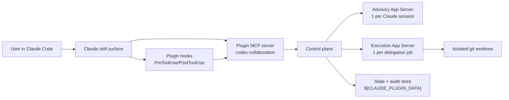

# Foundations

## Scope

**codex-collaboration** is a Claude Code plugin that gives Claude a structured second-opinion lane to OpenAI Codex. It supports three capabilities across two capability classes:

| Capability | Purpose | Capability Class | Runtime |
|---|---|---|---|
| **Consultation** | One-shot second opinions | Advisory | Advisory (shared) |
| **Dialogue** | Durable, branchable multi-turn discussion | Advisory | Advisory (shared) |
| **Delegation** | Autonomous task execution in isolation | Execution | Execution (ephemeral) |

### Goals

- Give Claude a structured second-opinion lane to Codex.
- Support durable, branchable, multi-turn Claude-to-Codex dialogues.
- Support autonomous Codex task execution without weakening Claude's control.
- Preserve strong trust boundaries around secrets, paths, sandboxing, and write surfaces.
- Make crash recovery and lineage explicit.
- Stay on stable App Server APIs where possible.

### Non-Goals

- Preserve compatibility with the current `cross-model` contracts. See [decisions.md §Greenfield Rules](decisions.md#greenfield-rules) for the explicit break list.
- Expose raw App Server methods to Claude.
- Depend on experimental App Server features for core flows when a stable path exists.
- Let Codex write directly into the user's primary working tree during delegation.
- Use Codex-side plugin/app discovery as a core dependency.

## Terminology

| Term | Definition |
|---|---|
| **Capability** | One of three interaction modes: consultation, dialogue, or delegation. |
| **Capability class** | A trust category that groups related capabilities. Two classes: advisory (consultation + dialogue) and execution (delegation). Each class has a defined trust level, runtime scope, and approval boundary. |
| **Runtime domain** | The App Server process scope in which Codex operates. Advisory and execution are the two domains. |
| **Advisory domain** | A long-lived App Server runtime for consultation and dialogue. One per Claude session and repo root. See [advisory-runtime-policy.md](advisory-runtime-policy.md) for lifecycle rules. |
| **Execution domain** | An ephemeral App Server runtime for delegation. One per delegation job, always in an isolated git worktree. |
| **Policy fingerprint** | An immutable identifier for the exact policy configuration of a runtime instance. See [advisory-runtime-policy.md §Policy Fingerprint Model](advisory-runtime-policy.md#policy-fingerprint-model). |
| **Collaboration handle** | The plugin's logical identifier for a Codex interaction. Wraps raw Codex thread IDs. See [contracts.md §CollaborationHandle](contracts.md#collaborationhandle). |
| **Delegation job** | A unit of autonomous execution work. One job = one runtime = one worktree. See [contracts.md §DelegationJob](contracts.md#delegationjob). |
| **Promotion** | Applying delegation results from an isolated worktree back to the user's primary workspace. See [promotion-protocol.md](promotion-protocol.md). |
| **Operation journal** | A crash-safe, session-bounded log for idempotent replay. See [recovery-and-journal.md §Operation Journal](recovery-and-journal.md#operation-journal). |
| **Audit log** | A best-effort, TTL-based log for human reconstruction. See [recovery-and-journal.md §Audit Log](recovery-and-journal.md#audit-log). |

## Architectural Shape

The plugin uses a split-runtime model with separate App Server processes for advisory and execution work. Claude never interacts with App Server directly — a control plane mediates all requests.

### Why Split Runtimes

App Server supports `acceptForSession` approval scope. A single runtime for both advisory and execution work would allow session-scoped approvals to bleed across capability classes — advisory read-only work could inherit delegation-grade write permissions, or vice versa.

Separate runtimes make the session scope boundary match the trust boundary.

## Runtime Domains

### Advisory Domain

One advisory App Server runtime per Claude session and repo root. Long-lived for the session duration.

Storage: `${CLAUDE_PLUGIN_DATA}/runtimes/advisory/<claude-session-id>/`

Policy defaults:

| Parameter | Default |
|---|---|
| Transport | stdio only |
| Sandbox | read-only |
| Approvals | disabled |
| App connectors | disabled |
| Dynamic tools | disabled (v1) |
| File-change approvals | auto-declined |
| Network approvals | auto-declined unless explicitly requested |

Consultation and dialogue share the advisory runtime because they are the same capability class. For advisory runtime lifecycle rules (policy widening, narrowing, rotation), see [advisory-runtime-policy.md](advisory-runtime-policy.md).

### Execution Domain

One ephemeral App Server runtime per delegation job. One isolated git worktree per job.

Storage: `${CLAUDE_PLUGIN_DATA}/runtimes/delegation/<job-id>/`

Policy defaults:

| Parameter | Default |
|---|---|
| Transport | stdio only |
| Sandbox | workspace-write inside isolated worktree only |
| Network | disabled |
| Approvals | disabled |
| Unsupported escalations | become `needs_escalation` job state |
| App connectors | disabled |

No session-scoped approval or write state can leak between jobs. Codex never mutates the user's primary working tree directly. Claude stays primary by reviewing and promoting results after the job ends.

## Trust Model

Three nested trust boundaries enforce defense-in-depth.

### Outer Boundary: Claude Hook Guard

The Claude-side `PreToolUse` hook is the authoritative enforcement point. It sits outside the plugin, so a plugin bug cannot silently bypass it.

Responsibilities:

- Secret scanning on outgoing payloads
- Forbidden path detection
- Oversized or overbroad context rejection
- Delegation policy checks before job creation
- Explicit deny or ask decisions before the plugin MCP tool runs

### Middle Boundary: Control Plane Policy Engine

The plugin MCP server validates:

- Which capability class is being requested
- Whether a runtime may be reused or must be isolated
- Whether web/network access is allowed
- Whether raw file writes are allowed
- Whether an approval may be answered automatically or must be surfaced back to Claude

### Inner Boundary: Codex Runtime Sandbox

App Server enforces sandboxing, approval semantics, and thread/session state. This is defense-in-depth, not the only barrier.

## Approval Invariant

**Session-scoped approvals never cross capability classes or delegation jobs.**

- Consult and dialogue share an advisory runtime. All approvals within it are per-request only — `acceptForSession` is never used in the advisory domain (see [advisory-runtime-policy.md §Advisory Approval Scope](advisory-runtime-policy.md#advisory-approval-scope)).
- Each delegation job gets its own runtime, so `acceptForSession` can never affect any other job.
- If a future capability needs broader access than advisory but less than full delegation, it gets its own runtime class.

## Core Flow Baselines

### Consultation

1. Claude calls `codex.consult` (see [MCP tool surface](contracts.md#mcp-tool-surface)).
2. The [hook guard](#outer-boundary-claude-hook-guard) validates the outgoing payload.
3. The control plane starts or reuses the advisory runtime.
4. The control plane starts a fresh Codex thread or forks an existing one.
5. The control plane sends `turn/start` and projects streamed items into a structured result: Codex position, evidence/citations, uncertainties, suggested follow-up branches.
6. Claude synthesizes the final answer.

### Dialogue

1. Claude calls `codex.dialogue.start`.
2. The plugin creates a root advisory thread and returns a [collaboration_id](contracts.md#collaborationhandle).
3. Follow-up turns call `codex.dialogue.reply`.
4. Branches call `codex.dialogue.fork`, which maps to App Server `thread/fork`.
5. The plugin records parent-child lineage independently of raw `threadId`.
6. `codex.dialogue.read` reconstructs the logical dialogue tree from plugin lineage plus Codex thread history.

### Delegation

1. Claude calls `codex.delegate.start`.
2. The plugin creates an isolated worktree from the current branch tip.
3. The plugin starts a fresh execution runtime bound to that worktree.
4. Codex executes autonomously inside the worktree.
5. If App Server raises a server request: unsupported escalations become `needs_escalation`; Claude resolves them with `codex.delegate.decide`.
6. When the job completes, the plugin computes: diff summary, changed files, test results, unresolved risks.
7. Claude reviews the result.
8. If accepted, `codex.delegate.promote` applies the diff into the main workspace. See [promotion-protocol.md](promotion-protocol.md) for the promotion state machine and preconditions.

## Prompting Contract

The plugin owns Codex-side prompt templates. Each capability builds a structured packet with:

- Objective
- Relevant repository context
- User constraints
- Safety envelope
- Expected output shape
- Capability-specific instructions

The plugin does not rely on Codex-side skills, plugin discovery, or App Server collaboration modes for core behavior in v1. The stable baseline is: explicit prompt packets plus stable thread/turn APIs.

## Chosen Defaults

| Topic | Default |
|---|---|
| Codex transport | App Server over stdio |
| Advisory runtime reuse | one per Claude session + repo root |
| Delegation runtime reuse | never; one per job |
| Delegation write target | isolated git worktree |
| Promotion to main workspace | explicit second step after Claude review |
| Advisory network access | off by default |
| Delegation network access | off by default |
| Codex apps/connectors | disabled by default |
| Codex-side plugin dependency | none for v1 |
| Plugin agents | optional only; not part of trust enforcement |
| Durable plugin state | `${CLAUDE_PLUGIN_DATA}` |
| Max concurrent delegation jobs | 1 (see [recovery-and-journal.md §Concurrency Limits](recovery-and-journal.md#concurrency-limits)) |

## Compatibility Invariants

The system fails closed if its required contract is not met.

- A minimum Codex CLI / App Server version is pinned.
- The generated schema for that version is vendored into tests.
- Startup verifies: `codex` present, auth available, App Server initialize handshake succeeds, required stable methods present.
- If any check fails, the plugin refuses to start.

The system does not rely on: WebSocket transport, dynamic tools, `plugin/list`, `plugin/read`, `plugin/install`, `plugin/uninstall`, or other experimental APIs for core functionality.
