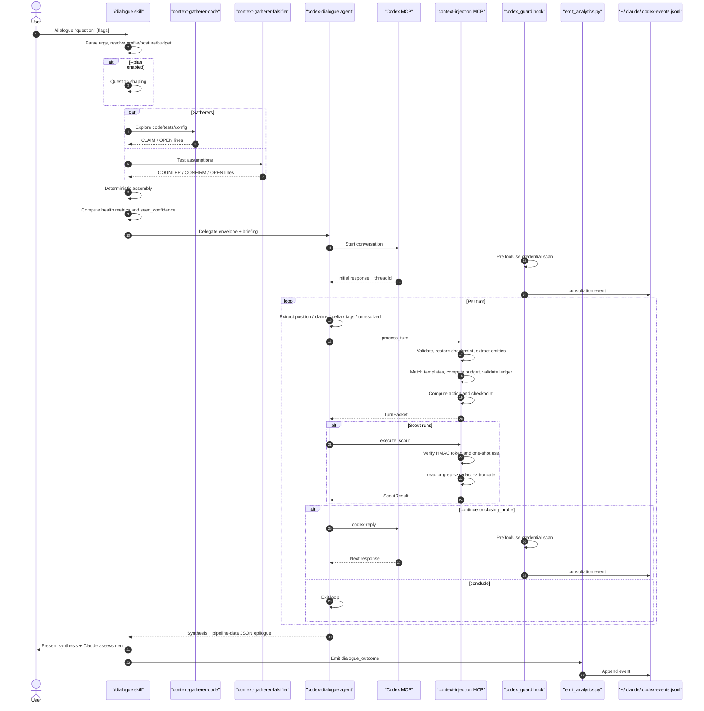

# Cross-Model Plugin Operational Handbook

Operational runbook for the full `packages/plugins/cross-model` plugin. This handbook covers bring-up, entrypoint selection, shared safety controls, observability, failure recovery, and subsystem ownership across `/codex`, `/dialogue`, `/delegate`, and `/consultation-stats`.

The package lives at [packages/plugins/cross-model](/Users/jp/Projects/active/claude-code-tool-dev/packages/plugins/cross-model). The most important normative references are:

- [packages/plugins/cross-model/README.md](/Users/jp/Projects/active/claude-code-tool-dev/packages/plugins/cross-model/README.md)
- [packages/plugins/cross-model/references/consultation-contract.md](/Users/jp/Projects/active/claude-code-tool-dev/packages/plugins/cross-model/references/consultation-contract.md)
- [packages/plugins/cross-model/references/context-injection-contract.md](/Users/jp/Projects/active/claude-code-tool-dev/packages/plugins/cross-model/references/context-injection-contract.md)

### Document Authority

| Document | Role |
|----------|------|
| `references/*.md` | Normative protocol specs — single source of truth for behavior |
| `skills/`, `agents/` | Executable instructions conforming to contracts |
| `README.md` | Overview, setup, architecture |
| `HANDBOOK.md` (this file) | Operations, troubleshooting, failure recovery |

This handbook describes how to operate and debug the plugin. For protocol definitions (briefing structure, safety tiers, relay format, scope rules), see the contracts linked above.

## Purpose and Scope

The cross-model plugin gives Claude a structured way to consult or delegate to Codex while keeping Claude primary. The plugin combines:

- skill-level orchestration
- agent-level dialogue management
- credential and scope enforcement
- autonomous execution gates for delegation
- a stateful MCP server for mid-conversation evidence gathering
- deterministic analytics emission and reporting

This document is plugin-wide. It is not limited to `/dialogue`.

## Plugin At a Glance

The plugin has four user-facing entrypoints:

| Entrypoint | Primary Use | Execution Model | Trust Model | Key Output |
|------------|-------------|-----------------|-------------|------------|
| `/codex` | quick second opinion | direct Codex MCP call or delegated dialogue | egress sanitization + hook enforcement | consultation answer + Claude assessment |
| `/dialogue` | deep multi-turn consultation | orchestrated dialogue + gatherers + context injection | egress sanitization + hook enforcement + scope envelope | synthesis + pipeline diagnostics |
| `/delegate` | autonomous coding work | `codex exec` via adapter | sandbox containment + preflight gates + post-run Claude review | code changes + review summary |
| `/consultation-stats` | usage and quality reporting | local analytics computation | reads event log only | metrics report |

The package is split into five layers:

1. Skills in [packages/plugins/cross-model/skills](/Users/jp/Projects/active/claude-code-tool-dev/packages/plugins/cross-model/skills)
2. Agents in [packages/plugins/cross-model/agents](/Users/jp/Projects/active/claude-code-tool-dev/packages/plugins/cross-model/agents)
3. Hook and analytics scripts in [packages/plugins/cross-model/scripts](/Users/jp/Projects/active/claude-code-tool-dev/packages/plugins/cross-model/scripts)
4. Contracts and profiles in [packages/plugins/cross-model/references](/Users/jp/Projects/active/claude-code-tool-dev/packages/plugins/cross-model/references)
5. Vendored context-injection server in [packages/plugins/cross-model/context-injection](/Users/jp/Projects/active/claude-code-tool-dev/packages/plugins/cross-model/context-injection)

## Core Components

### Skills

- [packages/plugins/cross-model/skills/codex/SKILL.md](/Users/jp/Projects/active/claude-code-tool-dev/packages/plugins/cross-model/skills/codex/SKILL.md): direct consultation path
- [packages/plugins/cross-model/skills/dialogue/SKILL.md](/Users/jp/Projects/active/claude-code-tool-dev/packages/plugins/cross-model/skills/dialogue/SKILL.md): orchestrated multi-turn consultation
- [packages/plugins/cross-model/skills/delegate/SKILL.md](/Users/jp/Projects/active/claude-code-tool-dev/packages/plugins/cross-model/skills/delegate/SKILL.md): autonomous Codex execution
- [packages/plugins/cross-model/skills/consultation-stats/SKILL.md](/Users/jp/Projects/active/claude-code-tool-dev/packages/plugins/cross-model/skills/consultation-stats/SKILL.md): analytics reporting

### Agents

- [packages/plugins/cross-model/agents/codex-dialogue.md](/Users/jp/Projects/active/claude-code-tool-dev/packages/plugins/cross-model/agents/codex-dialogue.md): live multi-turn dialogue manager
- [packages/plugins/cross-model/agents/codex-reviewer.md](/Users/jp/Projects/active/claude-code-tool-dev/packages/plugins/cross-model/agents/codex-reviewer.md): code review specialist
- [packages/plugins/cross-model/agents/context-gatherer-code.md](/Users/jp/Projects/active/claude-code-tool-dev/packages/plugins/cross-model/agents/context-gatherer-code.md): code-focused pre-dialogue gatherer
- [packages/plugins/cross-model/agents/context-gatherer-falsifier.md](/Users/jp/Projects/active/claude-code-tool-dev/packages/plugins/cross-model/agents/context-gatherer-falsifier.md): assumption-testing pre-dialogue gatherer

### Hooks and scripts

- [packages/plugins/cross-model/scripts/codex_guard.py](/Users/jp/Projects/active/claude-code-tool-dev/packages/plugins/cross-model/scripts/codex_guard.py): PreToolUse and PostToolUse enforcement hook
- [packages/plugins/cross-model/scripts/nudge_codex.py](/Users/jp/Projects/active/claude-code-tool-dev/packages/plugins/cross-model/scripts/nudge_codex.py): opt-in PostToolUseFailure nudge after repeated Bash failures
- [packages/plugins/cross-model/scripts/credential_scan.py](/Users/jp/Projects/active/claude-code-tool-dev/packages/plugins/cross-model/scripts/credential_scan.py): shared credential detector
- [packages/plugins/cross-model/scripts/secret_taxonomy.py](/Users/jp/Projects/active/claude-code-tool-dev/packages/plugins/cross-model/scripts/secret_taxonomy.py): pattern definitions and tiers
- [packages/plugins/cross-model/scripts/emit_analytics.py](/Users/jp/Projects/active/claude-code-tool-dev/packages/plugins/cross-model/scripts/emit_analytics.py): deterministic outcome emitter
- [packages/plugins/cross-model/scripts/read_events.py](/Users/jp/Projects/active/claude-code-tool-dev/packages/plugins/cross-model/scripts/read_events.py): event reader and classifier
- [packages/plugins/cross-model/scripts/compute_stats.py](/Users/jp/Projects/active/claude-code-tool-dev/packages/plugins/cross-model/scripts/compute_stats.py): report computation
- [packages/plugins/cross-model/scripts/codex_delegate.py](/Users/jp/Projects/active/claude-code-tool-dev/packages/plugins/cross-model/scripts/codex_delegate.py): `/delegate` adapter
- [packages/plugins/cross-model/scripts/event_log.py](/Users/jp/Projects/active/claude-code-tool-dev/packages/plugins/cross-model/scripts/event_log.py): shared append helpers
- [packages/plugins/cross-model/scripts/stats_common.py](/Users/jp/Projects/active/claude-code-tool-dev/packages/plugins/cross-model/scripts/stats_common.py): shared filtering, parsing, and aggregation utilities for `compute_stats.py`
- [packages/plugins/cross-model/scripts/codex_consult.py](/Users/jp/Projects/active/claude-code-tool-dev/packages/plugins/cross-model/scripts/codex_consult.py): consultation adapter — wraps `codex exec` with programmatic `consult()` API
- [packages/plugins/cross-model/scripts/codex_shim.py](/Users/jp/Projects/active/claude-code-tool-dev/packages/plugins/cross-model/scripts/codex_shim.py): FastMCP MCP shim translating tool calls to the consultation adapter
- [packages/plugins/cross-model/scripts/consultation_safety.py](/Users/jp/Projects/active/claude-code-tool-dev/packages/plugins/cross-model/scripts/consultation_safety.py): shared safety utilities extracted from `codex_guard.py` (`ToolScanPolicy`, `SafetyVerdict`, `check_tool_input`)
- [packages/plugins/cross-model/scripts/retrieve_learnings.py](/Users/jp/Projects/active/claude-code-tool-dev/packages/plugins/cross-model/scripts/retrieve_learnings.py): keyword/tag-scored learning retrieval for consultation briefings
- [packages/plugins/cross-model/scripts/event_schema.py](/Users/jp/Projects/active/claude-code-tool-dev/packages/plugins/cross-model/scripts/event_schema.py): single source of truth for event field definitions, schema versioning, and enum value sets
- [packages/plugins/cross-model/scripts/validate_graduation.py](/Users/jp/Projects/active/claude-code-tool-dev/packages/plugins/cross-model/scripts/validate_graduation.py): validates consistency between graduation.json, annotations.jsonl, and per-dialogue diagnostics
- [packages/plugins/cross-model/scripts/validate_profiles.py](/Users/jp/Projects/active/claude-code-tool-dev/packages/plugins/cross-model/scripts/validate_profiles.py): validates consultation-profiles.yaml against contract §14 invariants

### Context-injection server

Important note: the copy under the plugin is the canonical `context-injection` package. Durable changes belong in [packages/plugins/cross-model/context-injection](/Users/jp/Projects/active/claude-code-tool-dev/packages/plugins/cross-model/context-injection), and its package-local tests live alongside the code.

Primary modules:

- [packages/plugins/cross-model/context-injection/context_injection/server.py](/Users/jp/Projects/active/claude-code-tool-dev/packages/plugins/cross-model/context-injection/context_injection/server.py): MCP tool registration and startup gates
- [packages/plugins/cross-model/context-injection/context_injection/pipeline.py](/Users/jp/Projects/active/claude-code-tool-dev/packages/plugins/cross-model/context-injection/context_injection/pipeline.py): `process_turn`
- [packages/plugins/cross-model/context-injection/context_injection/execute.py](/Users/jp/Projects/active/claude-code-tool-dev/packages/plugins/cross-model/context-injection/context_injection/execute.py): `execute_scout`
- [packages/plugins/cross-model/context-injection/context_injection/types.py](/Users/jp/Projects/active/claude-code-tool-dev/packages/plugins/cross-model/context-injection/context_injection/types.py): protocol shapes
- [packages/plugins/cross-model/context-injection/context_injection/state.py](/Users/jp/Projects/active/claude-code-tool-dev/packages/plugins/cross-model/context-injection/context_injection/state.py): HMAC tokens, turn-request store, conversation map
- [packages/plugins/cross-model/context-injection/context_injection/conversation.py](/Users/jp/Projects/active/claude-code-tool-dev/packages/plugins/cross-model/context-injection/context_injection/conversation.py): immutable conversation state
- [packages/plugins/cross-model/context-injection/context_injection/templates.py](/Users/jp/Projects/active/claude-code-tool-dev/packages/plugins/cross-model/context-injection/context_injection/templates.py): scout template matching and option synthesis
- [packages/plugins/cross-model/context-injection/context_injection/paths.py](/Users/jp/Projects/active/claude-code-tool-dev/packages/plugins/cross-model/context-injection/context_injection/paths.py): path normalization, denylist, and git gating
- [packages/plugins/cross-model/context-injection/context_injection/entities.py](/Users/jp/Projects/active/claude-code-tool-dev/packages/plugins/cross-model/context-injection/context_injection/entities.py): entity extraction
- [packages/plugins/cross-model/context-injection/context_injection/ledger.py](/Users/jp/Projects/active/claude-code-tool-dev/packages/plugins/cross-model/context-injection/context_injection/ledger.py): ledger validation and derived counters
- [packages/plugins/cross-model/context-injection/context_injection/control.py](/Users/jp/Projects/active/claude-code-tool-dev/packages/plugins/cross-model/context-injection/context_injection/control.py): action computation and ledger summary
- [packages/plugins/cross-model/context-injection/context_injection/redact.py](/Users/jp/Projects/active/claude-code-tool-dev/packages/plugins/cross-model/context-injection/context_injection/redact.py): redaction orchestration
- [packages/plugins/cross-model/context-injection/context_injection/redact_formats.py](/Users/jp/Projects/active/claude-code-tool-dev/packages/plugins/cross-model/context-injection/context_injection/redact_formats.py): per-format redactors
- [packages/plugins/cross-model/context-injection/context_injection/grep.py](/Users/jp/Projects/active/claude-code-tool-dev/packages/plugins/cross-model/context-injection/context_injection/grep.py): `rg` execution and grep evidence building
- [packages/plugins/cross-model/context-injection/context_injection/truncate.py](/Users/jp/Projects/active/claude-code-tool-dev/packages/plugins/cross-model/context-injection/context_injection/truncate.py): marker-safe truncation
- [packages/plugins/cross-model/context-injection/context_injection/checkpoint.py](/Users/jp/Projects/active/claude-code-tool-dev/packages/plugins/cross-model/context-injection/context_injection/checkpoint.py): checkpoint serialization and chain validation for opaque state snapshots
- [packages/plugins/cross-model/context-injection/context_injection/canonical.py](/Users/jp/Projects/active/claude-code-tool-dev/packages/plugins/cross-model/context-injection/context_injection/canonical.py): canonical serialization and entity key functions for HMAC payload generation

## Bring-Up and Health Checks

### Prerequisites

- Codex CLI installed: `npm install -g @openai/codex`
- Codex authenticated: `codex login` or `OPENAI_API_KEY` set
- Python 3.11 available for plugin scripts and the `context-injection` server
- `uv` available for `context-injection` server startup and local test execution
- `git` available on `PATH`
- POSIX runtime for `/dialogue` (`context-injection` rejects non-POSIX hosts)

Additional `/dialogue` runtime note:

- `.mcp.json` launches `context-injection` with `REPO_ROOT=${PWD}`. Start Claude from the repository you intend `/dialogue` to inspect.

Additional `/delegate` prerequisite:

- Codex CLI version must be at least `0.111.0`

### Auto-configured runtime surfaces

The plugin auto-configures two MCP servers:

| Server | Transport | Purpose |
|--------|-----------|---------|
| `codex` | stdio via `uv run codex_shim.py` (FastMCP) | consultation transport — local shim translates MCP tool calls to `codex exec` via `codex_consult.py`; replaces upstream `codex mcp-server` binary |
| `context-injection` | stdio via `uv run --directory ${CLAUDE_PLUGIN_ROOT}/context-injection python -m context_injection` | mid-dialogue evidence gathering |

The `codex` server is now a local FastMCP shim (`codex_shim.py`) rather than the upstream `codex mcp-server` binary. The shim is translation-only: it maps MCP tool parameters to the `consult()` API in `codex_consult.py`, which manages the `codex exec` subprocess. Safety enforcement (credential scan, telemetry) remains in `codex_guard.py` hooks and is unaffected by the shim.

D-prime transport stack (consultation path):

```
MCP tool call → codex_guard.py PreToolUse (credential scan)
  → codex_shim.py (FastMCP, parameter translation)
  → consult() in codex_consult.py (subprocess management)
  → codex exec CLI (actual Codex interaction)
  → codex_guard.py PostToolUse (telemetry)
```

Operational notes:

- MCP server wiring lives in [packages/plugins/cross-model/.mcp.json](/Users/jp/Projects/active/claude-code-tool-dev/packages/plugins/cross-model/.mcp.json).
- `context-injection` receives `REPO_ROOT=${PWD}` from `.mcp.json` and uses that root for tracked-file loading and path gates.
- `context-injection` startup gates fail fast if `git` is unavailable or the runtime is non-POSIX.

The plugin also auto-configures hooks in [packages/plugins/cross-model/hooks/hooks.json](/Users/jp/Projects/active/claude-code-tool-dev/packages/plugins/cross-model/hooks/hooks.json):

| Hook Event | Matcher | Script | Operational Effect |
|------------|---------|--------|--------------------|
| `PreToolUse` | `mcp__plugin_cross-model_codex__codex|mcp__plugin_cross-model_codex__codex-reply` | `codex_guard.py` | blocks or shadows outbound prompts based on credential scan |
| `PostToolUse` | same matcher | `codex_guard.py` | appends `consultation` telemetry |
| `PostToolUseFailure` | `Bash` | `nudge_codex.py` | optional nudge after repeated shell failures |

### Environment variables

| Variable | Default | Purpose |
|----------|---------|---------|
| `OPENAI_API_KEY` | unset | Codex auth fallback if not logged in |
| `CODEX_SANDBOX` | `seatbelt` | auto-set to prevent macOS Codex CLI panic |
| `REPO_ROOT` | `${PWD}` via `.mcp.json` | repo root consumed by `context-injection` for git-backed evidence access |
| `CROSS_MODEL_NUDGE` | unset | set to `1` to enable repeated-failure nudges |
| `CLAUDE_SESSION_ID` | unset (injected by Claude Code host) | session identifier appended to every analytics event; nullable |

### Fast health check

Use this sequence when validating a machine or install:

1. Confirm `codex --version` runs.
2. Confirm `uv --version` and `git --version` run.
3. Confirm the current working directory is the intended repo root for `/dialogue` so `.mcp.json` exports the correct `REPO_ROOT`.
4. Confirm the event log path `~/.claude/.codex-events.jsonl` is writable after a test invocation.
5. Run the plugin-local tests:

```bash
cd packages/plugins/cross-model
uv run pytest
```

6. Exercise the entrypoints in increasing order of complexity: `/codex`, `/dialogue`, `/delegate`, then `/consultation-stats`.

## Shared Operating Model

### Two trust models

The plugin has two distinct safety models:

- Consultation model for `/codex` and `/dialogue`: sanitize outbound text, enforce hook checks, preserve Claude primacy, constrain scope
- Delegation model for `/delegate`: do not send secrets in prompt, but rely primarily on sandbox containment plus adapter gates and mandatory post-run Claude review

Do not mix these models when debugging behavior. A failure or allowance in `/delegate` does not imply equivalent behavior in `/codex` or `/dialogue`.

### Normative consultation preflight

For `/codex` and `/dialogue`, the normative preflight lives in [packages/plugins/cross-model/references/consultation-contract.md](/Users/jp/Projects/active/claude-code-tool-dev/packages/plugins/cross-model/references/consultation-contract.md). Operators should treat four parts of that contract as authoritative:

- briefing contract
- safety pipeline
- continuity state contract
- relay assessment contract

Egress manifest requirements and re-consent triggers are defined in [consultation-contract.md §3, §6](references/consultation-contract.md).

### Credential enforcement

`codex_guard.py` is the shared hook for outbound consultations. Tier definitions and pattern families are specified in [consultation-contract.md §7](references/consultation-contract.md).

Operational consequences:

- strict or contextual match on PreToolUse returns exit code `2` and blocks dispatch
- broad match emits telemetry but does not block
- unexpected root-level fields are shadow-logged
- traversal failures also block PreToolUse

### Scope envelopes

`/dialogue` delegation envelopes can include a scope envelope that freezes:

- allowed roots
- allowed source classes

If the agent crosses that boundary, the required behavior is to stop the consultation and surface `termination_reason: scope_breach`. Contracted re-consent and resume-capsule expansion are still partially deferred.

### Continuity

For multi-turn consultation, the canonical continuity key is `threadId`. `conversationId` is a compatibility alias and must be normalized to `threadId` before continuing. If the upstream thread is invalid or expired, the consultation restarts with a rebuilt full briefing.

### Event log and analytics

All telemetry flows to `~/.claude/.codex-events.jsonl`.

| Event | Primary Source | Meaning |
|-------|----------------|---------|
| `block` | `codex_guard.py` | consultation dispatch blocked |
| `shadow` | `codex_guard.py` | suspicious but non-blocking signal |
| `consultation` | `codex_guard.py` | Codex MCP tool call completed |
| `consultation_outcome` | `emit_analytics.py` | `/codex` outcome |
| `dialogue_outcome` | `emit_analytics.py` | `/dialogue` outcome |
| `delegation_outcome` | `codex_delegate.py` | `/delegate` outcome |

Analytics emission is best-effort. The user-facing result still returns when emission fails.

For dialogue analytics, `dialogue_outcome` also records the execution `mode` (`server_assisted` or `manual_legacy`). `compute_stats.py` exposes that as `mode_counts`, so interpret dialogue quality metrics in mode context rather than assuming every session had scouting available.

## Entrypoint Selection

Use this matrix when deciding which entrypoint should carry the work:

| Situation | Recommended Entrypoint | Why |
|-----------|------------------------|-----|
| second opinion on a bounded question | `/codex` | lowest overhead |
| adversarial or evidence-backed multi-turn consultation | `/dialogue` | gatherers, scope envelope, scouting loop |
| Codex should modify code or run commands | `/delegate` | autonomous execution pipeline |
| audit usage, convergence, blocks, or delegation outcomes | `/consultation-stats` | reads event log only |

## `/codex` Runbook

### When to use

Use `/codex` when the user explicitly wants Codex input or a second opinion and the entrypoint should stay lightweight. The skill may still delegate longer self-contained sessions internally. Do not auto-invoke it without user intent.

### Inputs and defaults

Supported flags:

| Flag | Meaning | Default |
|------|---------|---------|
| `-m <model>` | explicit Codex model | omitted |
| `-s <sandbox>` | sandbox | `read-only` |
| `-a <approval-policy>` | approval policy | coupled to sandbox |
| `-t <reasoning-effort>` | reasoning effort | `xhigh` |

Operational notes:

- always pass resolved `sandbox`, `approval-policy`, and `config.model_reasoning_effort`
- do not invent model names; omit `model` unless explicitly provided
- unknown flags or enum mismatches are deterministic parse failures

### Flow

1. Parse arguments.
2. Build a contract-compliant briefing with `## Context`, `## Material`, and `## Question`.
3. Run consultation preflight and safety checks.
4. Select an execution branch:
   - direct consultation for bounded 1-2 turn work
   - delegated `codex-dialogue` session for expected 3+ turn, self-contained consultations
5. Direct branch: call `mcp__plugin_cross-model_codex__codex` for a new conversation or `mcp__plugin_cross-model_codex__codex-reply` for continuation.
6. Delegated branch: spawn `codex-dialogue`, pass the enriched briefing plus goal/posture/budget, and let the agent manage continuity. That delegated session may run in `server_assisted` or `manual_legacy` mode, and operator-level continuation follows the subagent `agentId`, not raw `threadId`.
7. Independently assess the Codex response or delegated synthesis before presenting it.
8. Emit `consultation_outcome`.

### Branch-specific continuity

| Branch | Primary Continuation Key | Notes |
|--------|---------------------------|-------|
| direct `/codex` | `threadId` | canonical Codex continuation identifier |
| delegated `/codex` | subagent `agentId` | `threadId` still exists inside the delegated session, but operator-level resumption follows the subagent |

### Output expectations

The relay format is governed by the consultation contract. The user-facing response should include:

- Codex position
- Claude assessment
- decision and next action

### Common failure modes

| Failure | Operational Response |
|---------|----------------------|
| invalid flags | return parse error; do not dispatch |
| missing prompt on new conversation | ask for a specific question |
| auth unavailable | remediate Codex login or API key |
| PreToolUse block | do not retry until payload is sanitized |
| timeout or ambiguous upstream failure | do not auto-retry; duplicates are possible |
| invalid or expired thread | rebuild briefing and start a fresh conversation |
| `codex` MCP server fails to start | verify shim dependencies: `uv` available, `mcp>=1.9.0` installed, Python 3.11+ on path; check `.mcp.json` command points to `codex_shim.py` |

## `/dialogue` Runbook

### When to use

Use `/dialogue` when a question benefits from evidence gathering, disagreement surfacing, or several Codex turns under a fixed scope.

### Inputs and defaults

Key controls:

| Control | Meaning |
|---------|---------|
| `-p <posture>` | conversation stance |
| `-n <turns>` | turn budget |
| `--profile <name>` | named posture and budget preset |
| `--plan` | Step 0 question shaping before any Codex contact |

Named profiles live in [packages/plugins/cross-model/references/consultation-profiles.yaml](/Users/jp/Projects/active/claude-code-tool-dev/packages/plugins/cross-model/references/consultation-profiles.yaml).

Gatherer output format is defined in [packages/plugins/cross-model/skills/dialogue/references/tag-grammar.md](/Users/jp/Projects/active/claude-code-tool-dev/packages/plugins/cross-model/skills/dialogue/references/tag-grammar.md) — the grammar for `CLAIM`, `COUNTER`, `CONFIRM`, and `OPEN` tagged lines consumed by the briefing assembler.

### High-level flow

1. Parse arguments and resolve posture, turn budget, and profile.
2. Optionally run Step 0 question shaping.
3. Derive assumptions and search terms.
4. Launch both gatherers in parallel.
5. Assemble a deterministic briefing and compute `seed_confidence`.
6. Delegate to `codex-dialogue` with scope envelope and briefing.
7. Start in `server_assisted` mode and iterate through Codex turns with optional context-injection scouting. If the delegated agent cannot establish a successful early `process_turn`, it can downgrade to `manual_legacy` and continue without scouting.
8. Produce synthesis, Claude assessment, and `dialogue_outcome` with the actual `mode`.

### Operational characteristics

- highest-complexity path in the plugin
- front-loaded before Codex sees anything
- only user-facing entrypoint that always runs the pre-dialogue gatherer pipeline and sentinel briefing assembly
- primary path for scope-envelope plus scouting behavior; delegated `/codex` can reuse the same `codex-dialogue` agent
- delegated agent starts in `server_assisted` mode and can downgrade to `manual_legacy` before the first successful `process_turn`

### Success criteria

Operationally successful dialogues have:

- a valid briefing sentinel or deliberate in-agent assembly
- clean continuity via `threadId`
- either valid `process_turn` responses or a deliberate early fallback to `manual_legacy`
- bounded scout activity when the session stays in `server_assisted`
- synthesis plus machine-readable epilogue including the final `mode`

Mode note:

- The `/dialogue` skill preflights all four MCP tools before launch, but the delegated `codex-dialogue` agent still owns the final mode decision and can downgrade before the first successful `process_turn`.

### Failure modes that do not invalidate the whole session

| Failure | Behavior |
|---------|----------|
| analytics emission failure | dialogue result still returns |
| no scout candidates | dialogue continues without evidence |
| context-injection unavailable at delegated-agent start | `codex-dialogue` can run `manual_legacy`; no scouting occurs |
| turn 1 `process_turn` retries exhaust with no successful call | `codex-dialogue` can fall back to `manual_legacy` and continue |
| transport failure after a prior successful `process_turn` | do not switch to `manual_legacy`; synthesize from accumulated `turn_history` |
| helper restart before Call 1 with checkpoint present | state can recover on next `process_turn` |
| helper restart before Call 2 | scout request can fail with `invalid_request`; agent continues without that scout |

## `/delegate` Runbook

### When to use

Use `/delegate` when the user wants Codex to perform work rather than advise. This includes writing code, fixing bugs, refactoring, generating files, or running commands inside a sandbox.

### Distinct safety model

`/delegate` does not use the consultation sanitizer path as its primary trust boundary. Instead it relies on:

- prompt credential scan inside the adapter
- Codex CLI version gate
- clean-tree gate
- readable secret-file gate
- sandbox restriction
- mandatory Claude review of any resulting changes

### Inputs and defaults

| Flag | Meaning | Default |
|------|---------|---------|
| `-m <model>` | explicit Codex model | omitted |
| `-s <sandbox>` | sandbox | `workspace-write` |
| `-t <reasoning-effort>` | reasoning effort | `high` |
| `--full-auto` | opt-in automation | off |

Hard restrictions:

- `danger-full-access` is unsupported
- `--full-auto` cannot be combined with `read-only`
- empty prompt is a user-facing ask, not a dispatch

### Adapter pipeline

The adapter in [packages/plugins/cross-model/scripts/codex_delegate.py](/Users/jp/Projects/active/claude-code-tool-dev/packages/plugins/cross-model/scripts/codex_delegate.py) runs this operational sequence:

1. resolve repo root
2. allocate output temp file
3. parse input JSON (Phase A — captures data for analytics)
4. credential scan
5. validate fields and conflicts (Phase B)
6. verify Codex CLI version
7. enforce clean-tree gate
8. enforce readable secret-file gate
9. build `codex exec` command
10. run subprocess
11. parse JSONL output
12. read summarized result
13. emit analytics
14. clean adapter-owned temp artifacts

### Output interpretation

Adapter output distinguishes `status` from `dispatched`:

| Status | `dispatched` | Meaning | Operator Action |
|--------|--------------|---------|-----------------|
| `blocked` | `false` | pre-dispatch gate stopped the run | report reason; no review needed |
| `error` | `false` | adapter failed before Codex ran | report error; no review needed |
| `error` | `true` | Codex ran and then failed | always review resulting changes |
| `ok` | `true` | Codex finished | always review resulting changes |

### Mandatory review

After any dispatched run, Claude must inspect:

- `git status --short`
- `git diff`
- `git diff --cached`
- contents of new untracked files

Never report `/delegate` success without review.

### Secret-file gate limitations

Known limitations of the readable-secret-file gate:

- it matches filenames and globs, not symlink targets
- it cannot detect arbitrarily named secret files outside its known pathspecs
- tracked repo files remain readable to Codex inside the sandbox

Use `/delegate` only when the tracked repo contents are acceptable to expose to Codex under the selected sandbox.

## `/consultation-stats` Runbook

### When to use

Use `/consultation-stats` to inspect usage, convergence, context quality, security blocks, or delegation outcomes.

### Inputs and defaults

Defaults:

- period: 30 days
- type: `all`

Common mappings:

| User intent | Parameters |
|-------------|------------|
| last week | `--period 7` |
| last month | `--period 30` |
| all time | `--period 0` |
| just security | `--type security` |
| just dialogues | `--type dialogue` |
| just consultations | `--type consultation` |
| just delegations | `--type delegation` |

### Computation path

Run [packages/plugins/cross-model/scripts/compute_stats.py](/Users/jp/Projects/active/claude-code-tool-dev/packages/plugins/cross-model/scripts/compute_stats.py) with `--json`. The script reads the event log, filters by period, computes section metrics, and returns structured output.

Do not compute report numbers manually in the skill path. If the script fails or the event log does not exist, report that no consultation data was found.

### Report sections

The computation script can emit:

- usage
- dialogue
- context
- security
- delegation

The section set depends on `--type`.

## `/dialogue` Deep Internals

`/dialogue` remains the deepest subsystem and carries the most operational nuance.

### End-to-end sequence



### `process_turn`

`process_turn` is the authoritative state machine. The implementation is [packages/plugins/cross-model/context-injection/context_injection/pipeline.py](/Users/jp/Projects/active/claude-code-tool-dev/packages/plugins/cross-model/context-injection/context_injection/pipeline.py).

It performs:

1. exact schema validation
2. dual-claims consistency guard
3. checkpoint restore or in-memory state lookup
4. turn-cap guard
5. entity extraction from current focus plus prior claims
6. compile-time path checks
7. template matching and evidence-budget computation
8. ledger validation and cumulative-state update
9. action computation
10. checkpoint serialization

The response is a `TurnPacketSuccess` or `TurnPacketError`.

### `execute_scout`

`execute_scout` is the constrained evidence executor. The implementation is [packages/plugins/cross-model/context-injection/context_injection/execute.py](/Users/jp/Projects/active/claude-code-tool-dev/packages/plugins/cross-model/context-injection/context_injection/execute.py).

It performs:

1. HMAC token verification via the stored signed spec
2. one-shot scout consumption
3. read or grep execution
4. runtime path validation
5. redaction or suppression
6. marker-safe truncation
7. evidence recording on success

The HMAC layer is implemented across:

- [packages/plugins/cross-model/context-injection/context_injection/state.py](/Users/jp/Projects/active/claude-code-tool-dev/packages/plugins/cross-model/context-injection/context_injection/state.py)
- [packages/plugins/cross-model/context-injection/context_injection/canonical.py](/Users/jp/Projects/active/claude-code-tool-dev/packages/plugins/cross-model/context-injection/context_injection/canonical.py)
- [packages/plugins/cross-model/context-injection/context_injection/templates.py](/Users/jp/Projects/active/claude-code-tool-dev/packages/plugins/cross-model/context-injection/context_injection/templates.py)

## Failure and Recovery Matrix

| Component | Failure | Expected Behavior | Recovery Path |
|-----------|---------|-------------------|---------------|
| consultation preflight | disallowed class, root, or budget breach | cancel before dispatch | reduce scope or re-consent |
| `codex_guard.py` | strict or contextual credential hit | block dispatch | sanitize or redact payload |
| `codex_guard.py` | process crash at OS level | fail-open limitation | treat as known residual risk; wrapper MCP needed for adversarial model |
| `codex_shim.py` | server fails to start | MCP tool unavailable | verify `uv`, `mcp>=1.9.0`, Python 3.11+; check `.mcp.json` command |
| `codex_consult.py` | `codex exec` subprocess not found | shim raises on dispatch | confirm `codex` CLI is installed and on `PATH` |
| Codex consultation | upstream timeout after dispatch uncertainty | no automatic retry | ask before retrying |
| continuity | invalid or expired `threadId` | start new conversation | rebuild briefing |
| `codex-dialogue` startup | context-injection unavailable before first successful `process_turn` | fallback to `manual_legacy` | continue without scouting; track `mode=manual_legacy` |
| `context-injection` Call 1 | missing checkpoint after helper restart | error on turn processing | resend with valid checkpoint or restart session |
| `context-injection` Call 2 | helper restart before scout | scout request can fail | continue without that scout |
| `context-injection` after prior successful Call 1 | degraded mid-session | do not switch modes | synthesize from stored `turn_history` |
| `/dialogue` | scope breach | terminate with `scope_breach` | future re-consent flow is partially deferred |
| `/delegate` | dirty working tree | blocked before dispatch | clean, stash, or commit unrelated changes |
| `/delegate` | readable secret file | blocked before dispatch | move, rename, or exempt safe template file |
| `/delegate` | Codex run fails after dispatch | changes may still exist | mandatory review |
| analytics | emitter failure | user-facing result still returns | inspect stderr or rerun emitter separately |
| stats | malformed log lines | skipped during computation | inspect log for corruption or old schema drift |
| `codex_shim.py` | unknown status from `consult()` | falls through to `ok` path, returns success with empty content | add new status to `_build_response` before adding it to `consult()` |

## File-by-File Change Map

Use this section when deciding where a behavior change belongs.

### Packaging and runtime wiring

Edit [packages/plugins/cross-model/.claude-plugin/plugin.json](/Users/jp/Projects/active/claude-code-tool-dev/packages/plugins/cross-model/.claude-plugin/plugin.json) when changing:

- plugin identity, version, or installer-facing metadata
- plugin name assumptions that downstream sync checks validate

Edit [packages/plugins/cross-model/.mcp.json](/Users/jp/Projects/active/claude-code-tool-dev/packages/plugins/cross-model/.mcp.json) when changing:

- MCP server commands or arguments
- runtime environment wiring such as `CODEX_SANDBOX` or `REPO_ROOT`
- which bundled server gets launched for `context-injection`

### Top-level consultation policy

Edit [packages/plugins/cross-model/references/consultation-contract.md](/Users/jp/Projects/active/claude-code-tool-dev/packages/plugins/cross-model/references/consultation-contract.md) when changing:

- briefing structure
- consultation preflight
- safety pipeline
- continuity rules
- relay format
- transport adapter expectations

### `/codex`

Edit [packages/plugins/cross-model/skills/codex/SKILL.md](/Users/jp/Projects/active/claude-code-tool-dev/packages/plugins/cross-model/skills/codex/SKILL.md) when changing:

- argument parsing
- invocation strategy selection
- direct versus delegated consultation choice
- consultation diagnostics requirements

### `/dialogue`

Edit [packages/plugins/cross-model/skills/dialogue/SKILL.md](/Users/jp/Projects/active/claude-code-tool-dev/packages/plugins/cross-model/skills/dialogue/SKILL.md) when changing:

- planning mode
- gatherer retry policy
- briefing assembly
- provenance handling
- `seed_confidence`
- scope-envelope construction
- delegated-mode assumptions passed to `codex-dialogue`
- analytics input fields

Edit [packages/plugins/cross-model/references/consultation-profiles.yaml](/Users/jp/Projects/active/claude-code-tool-dev/packages/plugins/cross-model/references/consultation-profiles.yaml) when changing:

- profile names
- posture defaults
- turn budgets
- multi-phase profile layout

Edit [packages/plugins/cross-model/agents/codex-dialogue.md](/Users/jp/Projects/active/claude-code-tool-dev/packages/plugins/cross-model/agents/codex-dialogue.md) when changing:

- mode gating between `server_assisted` and `manual_legacy`
- semantic extraction from Codex replies
- follow-up composition
- phase progression
- scope-breach handling
- final synthesis structure
- pipeline-data epilogue format

### Context-injection runtime startup

Edit these together when changing helper startup or repo-root behavior:

- [packages/plugins/cross-model/.mcp.json](/Users/jp/Projects/active/claude-code-tool-dev/packages/plugins/cross-model/.mcp.json)
- [packages/plugins/cross-model/context-injection/context_injection/server.py](/Users/jp/Projects/active/claude-code-tool-dev/packages/plugins/cross-model/context-injection/context_injection/server.py)
- [packages/plugins/cross-model/context-injection/README.md](/Users/jp/Projects/active/claude-code-tool-dev/packages/plugins/cross-model/context-injection/README.md)

### Context-injection protocol

Edit these together when changing the protocol:

- [packages/plugins/cross-model/context-injection/context_injection/types.py](/Users/jp/Projects/active/claude-code-tool-dev/packages/plugins/cross-model/context-injection/context_injection/types.py)
- [packages/plugins/cross-model/references/context-injection-contract.md](/Users/jp/Projects/active/claude-code-tool-dev/packages/plugins/cross-model/references/context-injection-contract.md)
- [packages/plugins/cross-model/agents/codex-dialogue.md](/Users/jp/Projects/active/claude-code-tool-dev/packages/plugins/cross-model/agents/codex-dialogue.md)

### Turn-state machine

Edit these when changing turn-state or action logic:

- [packages/plugins/cross-model/context-injection/context_injection/pipeline.py](/Users/jp/Projects/active/claude-code-tool-dev/packages/plugins/cross-model/context-injection/context_injection/pipeline.py)
- [packages/plugins/cross-model/context-injection/context_injection/ledger.py](/Users/jp/Projects/active/claude-code-tool-dev/packages/plugins/cross-model/context-injection/context_injection/ledger.py)
- [packages/plugins/cross-model/context-injection/context_injection/control.py](/Users/jp/Projects/active/claude-code-tool-dev/packages/plugins/cross-model/context-injection/context_injection/control.py)
- [packages/plugins/cross-model/context-injection/context_injection/conversation.py](/Users/jp/Projects/active/claude-code-tool-dev/packages/plugins/cross-model/context-injection/context_injection/conversation.py)
- [packages/plugins/cross-model/context-injection/context_injection/checkpoint.py](/Users/jp/Projects/active/claude-code-tool-dev/packages/plugins/cross-model/context-injection/context_injection/checkpoint.py)

### Entity extraction and scout selection

Edit these when changing what gets scouted and how it is ranked:

- [packages/plugins/cross-model/context-injection/context_injection/entities.py](/Users/jp/Projects/active/claude-code-tool-dev/packages/plugins/cross-model/context-injection/context_injection/entities.py)
- [packages/plugins/cross-model/context-injection/context_injection/enums.py](/Users/jp/Projects/active/claude-code-tool-dev/packages/plugins/cross-model/context-injection/context_injection/enums.py)
- [packages/plugins/cross-model/context-injection/context_injection/templates.py](/Users/jp/Projects/active/claude-code-tool-dev/packages/plugins/cross-model/context-injection/context_injection/templates.py)
- [packages/plugins/cross-model/context-injection/context_injection/canonical.py](/Users/jp/Projects/active/claude-code-tool-dev/packages/plugins/cross-model/context-injection/context_injection/canonical.py)
- [packages/plugins/cross-model/context-injection/context_injection/state.py](/Users/jp/Projects/active/claude-code-tool-dev/packages/plugins/cross-model/context-injection/context_injection/state.py) if token structure or one-shot behavior changes

### Path safety and evidence execution

Edit these when changing repo-access boundaries or execution behavior:

- [packages/plugins/cross-model/context-injection/context_injection/paths.py](/Users/jp/Projects/active/claude-code-tool-dev/packages/plugins/cross-model/context-injection/context_injection/paths.py)
- [packages/plugins/cross-model/context-injection/context_injection/execute.py](/Users/jp/Projects/active/claude-code-tool-dev/packages/plugins/cross-model/context-injection/context_injection/execute.py)
- [packages/plugins/cross-model/context-injection/context_injection/grep.py](/Users/jp/Projects/active/claude-code-tool-dev/packages/plugins/cross-model/context-injection/context_injection/grep.py)

### Redaction behavior

Edit these when changing file classification or redaction:

- [packages/plugins/cross-model/context-injection/context_injection/classify.py](/Users/jp/Projects/active/claude-code-tool-dev/packages/plugins/cross-model/context-injection/context_injection/classify.py)
- [packages/plugins/cross-model/context-injection/context_injection/redact.py](/Users/jp/Projects/active/claude-code-tool-dev/packages/plugins/cross-model/context-injection/context_injection/redact.py)
- [packages/plugins/cross-model/context-injection/context_injection/redact_formats.py](/Users/jp/Projects/active/claude-code-tool-dev/packages/plugins/cross-model/context-injection/context_injection/redact_formats.py)
- [packages/plugins/cross-model/context-injection/context_injection/truncate.py](/Users/jp/Projects/active/claude-code-tool-dev/packages/plugins/cross-model/context-injection/context_injection/truncate.py)

### Delegation

Edit [packages/plugins/cross-model/skills/delegate/SKILL.md](/Users/jp/Projects/active/claude-code-tool-dev/packages/plugins/cross-model/skills/delegate/SKILL.md) when changing:

- user-facing flag parsing
- required review steps
- troubleshooting and messaging

Edit [packages/plugins/cross-model/scripts/codex_delegate.py](/Users/jp/Projects/active/claude-code-tool-dev/packages/plugins/cross-model/scripts/codex_delegate.py) when changing:

- adapter gate behavior
- version requirements
- clean-tree or secret-file gates
- subprocess invocation
- delegation analytics fields

### Codex MCP shim

Edit these together when changing the consultation transport:

- [packages/plugins/cross-model/scripts/codex_shim.py](/Users/jp/Projects/active/claude-code-tool-dev/packages/plugins/cross-model/scripts/codex_shim.py): FastMCP server, tool registration, parameter translation
- [packages/plugins/cross-model/scripts/codex_consult.py](/Users/jp/Projects/active/claude-code-tool-dev/packages/plugins/cross-model/scripts/codex_consult.py): `consult()` API, `codex exec` subprocess lifecycle
- [packages/plugins/cross-model/scripts/consultation_safety.py](/Users/jp/Projects/active/claude-code-tool-dev/packages/plugins/cross-model/scripts/consultation_safety.py): `ToolScanPolicy`, `SafetyVerdict`, `check_tool_input` (shared between shim and guard)
- [packages/plugins/cross-model/.mcp.json](/Users/jp/Projects/active/claude-code-tool-dev/packages/plugins/cross-model/.mcp.json): server command pointing to `codex_shim.py`

Do NOT edit the shim to add safety logic. Safety enforcement belongs in `codex_guard.py` hooks; the shim is translation-only.

### Hooks and analytics

Edit these when changing plugin-wide enforcement or reporting:

- [packages/plugins/cross-model/hooks/hooks.json](/Users/jp/Projects/active/claude-code-tool-dev/packages/plugins/cross-model/hooks/hooks.json)
- [packages/plugins/cross-model/scripts/codex_guard.py](/Users/jp/Projects/active/claude-code-tool-dev/packages/plugins/cross-model/scripts/codex_guard.py)
- [packages/plugins/cross-model/scripts/nudge_codex.py](/Users/jp/Projects/active/claude-code-tool-dev/packages/plugins/cross-model/scripts/nudge_codex.py)
- [packages/plugins/cross-model/scripts/credential_scan.py](/Users/jp/Projects/active/claude-code-tool-dev/packages/plugins/cross-model/scripts/credential_scan.py)
- [packages/plugins/cross-model/scripts/secret_taxonomy.py](/Users/jp/Projects/active/claude-code-tool-dev/packages/plugins/cross-model/scripts/secret_taxonomy.py)
- [packages/plugins/cross-model/scripts/emit_analytics.py](/Users/jp/Projects/active/claude-code-tool-dev/packages/plugins/cross-model/scripts/emit_analytics.py)
- [packages/plugins/cross-model/scripts/read_events.py](/Users/jp/Projects/active/claude-code-tool-dev/packages/plugins/cross-model/scripts/read_events.py)
- [packages/plugins/cross-model/scripts/compute_stats.py](/Users/jp/Projects/active/claude-code-tool-dev/packages/plugins/cross-model/scripts/compute_stats.py)
- [packages/plugins/cross-model/scripts/stats_common.py](/Users/jp/Projects/active/claude-code-tool-dev/packages/plugins/cross-model/scripts/stats_common.py)
- [packages/plugins/cross-model/scripts/event_schema.py](/Users/jp/Projects/active/claude-code-tool-dev/packages/plugins/cross-model/scripts/event_schema.py): event field definitions and schema version resolution — edit when adding new analytics fields or event types

### Reference documents

Edit [packages/plugins/cross-model/references/composition-contract.md](/Users/jp/Projects/active/claude-code-tool-dev/packages/plugins/cross-model/references/composition-contract.md) when changing:

- cross-skill artifact exchange (sentinel detection, capsule formats, lineage)

Edit [packages/plugins/cross-model/references/dialogue-synthesis-format.md](/Users/jp/Projects/active/claude-code-tool-dev/packages/plugins/cross-model/references/dialogue-synthesis-format.md) when changing:

- Phase 3 synthesis output sections, confidence annotations, or pipeline-data epilogue format

Edit [packages/plugins/cross-model/references/contract-agent-extract.md](/Users/jp/Projects/active/claude-code-tool-dev/packages/plugins/cross-model/references/contract-agent-extract.md) when changing:

- the agent-readable contract subset (must stay in sync with consultation-contract.md §§4-5, §7-10, §15)

## Guardrails and Known Limitations

- PreToolUse hook execution is fail-closed for normal runtime errors, but actual hook-process crashes are fail-open by OS semantics.
- The context-injection tests live in `packages/plugins/cross-model/context-injection/tests`, not in `packages/plugins/cross-model/tests`.
- Scope re-consent after mid-dialogue scope expansion is still only partially implemented in the broader contract path.
- `nudge_codex.py` is opt-in only. If `CROSS_MODEL_NUDGE` is unset, repeated Bash failures do nothing. When enabled, the nudge fires after 3 consecutive Bash failures per session and resets after each nudge (so the suggestion recurs after another 3 failures).
- `/delegate` secret-file detection is conservative but incomplete: filename-based, not content-based. Known-safe artifacts like `certifi/cacert.pem` (Python root CA bundle) are exempt via component matching.
- Analytics are best-effort and should not be used as the sole source of truth for success or failure.
- Prompts exceeding 256 KiB trigger different behavior in different layers: `codex_guard.py` blocks (exit 2), while `codex_delegate.py` skips the credential scan with a stderr warning. In practice, the guard hook fires first on MCP calls, making the delegate bypass moot for interactive use — but programmatic delegate invocations bypass credential scanning on large prompts.

## Verification

### Plugin-local test suite

Two verification surfaces (do not attempt to unify into a single recursive run):

```bash
# Plugin root tests
cd packages/plugins/cross-model
uv run pytest
uv run ruff check scripts tests

# Context-injection server tests
cd packages/plugins/cross-model/context-injection
uv run pytest
uv run ruff check context_injection tests
```

All tests should pass with no failures.

Note: during the D4a→D4b schema migration, 18 `process_turn` tests in context-injection are marked `xfail(strict=True)` per `context-injection/tests/xfail_inventory_d4a.md`. These appear as expected failures, not errors.

### `/delegate` pre-dispatch smoke test

Use this sequence to confirm the delegation gate chain is operational without running a full Codex dispatch:

1. Confirm `codex --version` outputs a version `>= 0.111.0`.
2. Confirm `git status --porcelain` is empty (clean tree gate will pass).
3. Confirm no readable secret files exist (`git ls-files --others --ignored --exclude-standard` returns no `.env`, `*.pem`, `*.key`, `.npmrc`, `.netrc`, `auth.json`, or `*.p12` files).
4. Run a minimal delegation with `read-only` sandbox and a short prompt:

```bash
echo '{"prompt": "print hello world", "sandbox": "read-only"}' > /tmp/test_delegate.json
python3 packages/plugins/cross-model/scripts/codex_delegate.py /tmp/test_delegate.json
```

Expected output: JSON with `"status": "ok"` and `"dispatched": true`, or `"status": "blocked"` with a specific gate reason if a gate fires. A `"status": "error"` with `"dispatched": false` before subprocess start indicates a gate or version problem to investigate.
